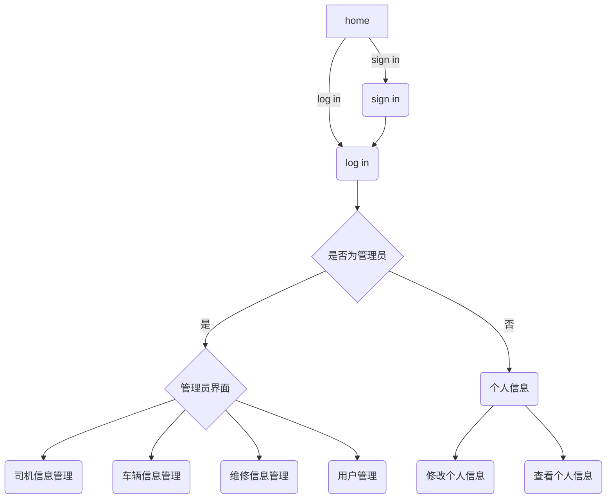
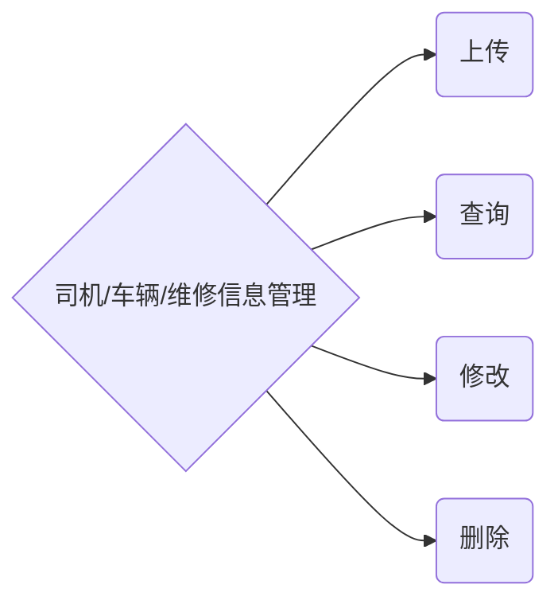
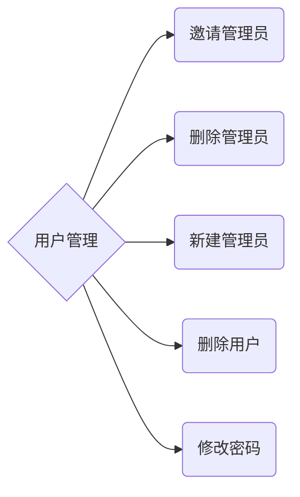

# car driver information manage system
## 需求文件

>运行平台 windows   
python3  版本：3.6.1  
MSSQL server 2017  
Flask (0.12.2)  
Flask-Bootstrap (3.3.7.1)  
Flask-Login (0.4.1)  
Flask-Migrate (2.1.1)  
Flask-Moment (0.5.2)  
Flask-MySQL (1.4.0)  
Flask-Script (2.0.6)  
Flask-SQLAlchemy (2.3.2)  
Flask-WTF (0.14.2)  
pymssql (2.1.3)  
virtualenv (15.1.0)  
Jinja2 (2.10)  
WTForms (2.1)  

## 简介

### 课程设计要求

 实践环节要求学生能够独立按预定题目开发出功能完善的小型管理信息系统。  
1. 握管理信息系统的开发方法学、各阶段的步骤、基本技术与方法；  
1. 要求规范化完成系统设计、实施与转换、调试、运行、管理与维护等阶段；  
1. 能够编写开发过程各阶段的主要文档；   
1. 要求提交系统说明书、用户手册、设计报告；  
1. B/S结构，SQL Server数据库  
1. 要求提交开发源代码  
1. 实践环节终了要求进行系统功能演示。  


数据库课程设计题目
### 题目：
>    实践内容30运输企业车辆信息管理系统
建立一套运输企业车辆信息管理系统，实现司机、车辆信息的系统化管理。  
*功能包括:*  
（1）用户管理：注册用户，设定权限，登录系统；  
（2）司机基本信息（驾照信息）的录入、查询、修改  
（3）车辆基本信息、驾照信息的录入、查询、修改  
（4）车辆维修信息的录入、查询、修改  

### 开发简介

* 基于flask实现的车辆信息管理系统
* UI框架使用bootstrap进行美化
* 数据库使用microsoft SQL server
* html使用jinja2模板引擎渲染
* 数据库仓库迁移使用flask-Migrate
* Flask-Moment 本地化时间和日期
* Flask-AQLAlchemy 管理数据库
* python shell 命令行启动与管理
* Flask-Login 认证用户
* Flask-WTF 渲染表单

#### 工程项目文件结构

```txt
│  .gitattributes
│  README.md(说明文档)
│  tree.txts(树形结构文档)
│  
└─builds
    └─manage_system(app文件夹)
        │  config.py(配置)
        │  run.py（运行）
        │  
        ├─.idea
        │  │  manage_system.iml
        │  │  misc.xml
        │  │  modules.xml
        │  │  workspace.xml
        │  │  
        │  ├─dictionaries
        │  │      .xml
        │  │      
        │  └─inspectionProfiles
        │          Project_Default.xml
        │          
        ├─app
        │  │  forms.py(表单类)
        │  │  models.py(数据库模型类)
        │  │  views.py(视图，路由处理)
        │  │  __init__.py(初始设置)
        │  │  
        │  ├─static
        │  │  └─image
        │  │      └─icon
        │  │              OS_Linux_ubuntu.ico(图标)
        │  │              
        │  ├─templates(html 模板)
        │  │      404.html
        │  │      admin.html
        │  │      admin_menu.html
        │  │      base.html
        │  │      driver_info_search.html
        │  │      home.html
        │  │      login.html
        │  │      normal_change_password.html
        │  │      normal_user.html
        │  │      operations.html
        │  │      operation_result.html
        │  │      search_result.html
        │  │      signin.html
        │  │      test.html
        │  │      
        │  └─__pycache__
        │          forms.cpython-36.pyc
        │          models.cpython-36.pyc
        │          views.cpython-36.pyc
        │          __init__.cpython-36.pyc
        │          
        ├─flask
        ├─migrations(数据库迁移仓库)
        │  │  alembic.ini
        │  │  env.py
        │  │  README
        │  │  script.py.mako
        │  │  
        │  ├─versions
        │  │  │  801d9e9617a8_inital_migration.py
        │  │  │  ae61f2765b45_second_migration.py
        │  │  │  
        │  │  └─__pycache__
        │  │          801d9e9617a8_inital_migration.cpython-36.pyc
        │  │          ae61f2765b45_second_migration.cpython-36.pyc
        │  │          
        │  └─__pycache__
        │          env.cpython-36.pyc
        │          
        ├─tmp(缓存文件)
        └─__pycache__
                config.cpython-36.pyc
                

```

#### 数据库table

* User  

  | 列| id | user_id | nick_name | password |
  |:--|:----|:---------|:---------|:---------|
  |说明 | 主键|用户编号 | 昵称 |密码 |
  | 类型|Integer |String(10) |Unicode(32) |String(32) |  

* Admin  

  |列 | id | admin_id |  
  |:-|:----|:----------|  
  |说明 | 主键 |用户编号|
  | 类型|Integer|String(10)  


* DriverInfo  

 |列|id| driver_id| license_id|real_name |
 |:-|:-|:-|:-|:-|
 | 说明|主键 |用户编号 |驾照编号 |真实姓名 |
 | 类型|Integar |String(10) |String(20) |Unicode(32) |

* CarInfo  

 | 列|id |car_id |bought_time |car_type |driver_id |
 |:- |:- |:- |:- |:- |:- |
 | 说明|主键 |车辆编号 |购买日期(年/月) |车辆型号 |驾驶人编号 |
 | 类型|Integar |String(32) |String(10) |String(32) |String(10) |

* RepairRecord  

| 列|id |car_id |broken_time |fee |is_fixed|
|:-|:-|:-|:-|:-|:-|
|说明|主键|车辆编号|损坏时间|花费|是否修好|
|类型|Integar|String(32)|String(10)|Integar|Boolean|

* 各个表格时间的关系

    *    User.user_id => Admin.admin_id => DriverInfo.driver_id => CarInfo.driver_id  
    *    CarInfo.car_id => RepairRecord.car_id  


#### 项目文件结构

[文件结构树位于tree.txt文件夹](./tree.txt)

#### 运行

进入app文件夹(包含run.py的文件夹)
>python3 run.py runserver

运行服务器  
本地浏览器访问127.0.0.1:5000即可访问主页面


## 流程介绍







## 总结

这次的数据库课设花费了很多时间，不仅仅是数据库部分的内容，还涉及了网页结构，前端后端之间的交互等等，让我了解到一个大型项目的所需要做的很多东西，也有很多的不足之处。想要搭建一个网站需要大量的人力物力财力，当然这只是搭建，后面还有很多运营和维护之类的事情。最重要的是通过操作，逐渐掌握了如何使用数据库，设计一个更加高效速度更加快的数据库的重要性。学会使用数据迁移仓库，方便更改数据库的列表之类的，可以回退到上一个版本，或者移到下一个版本，当前表的记录都会得到保留，当数据库发生炸库的时候，能有效得到恢复。
